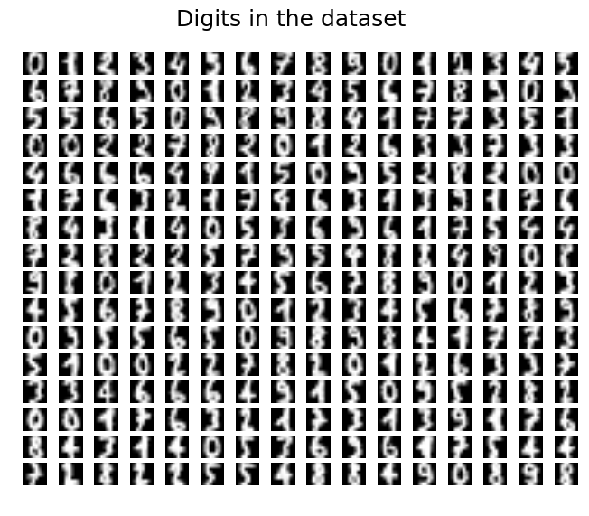
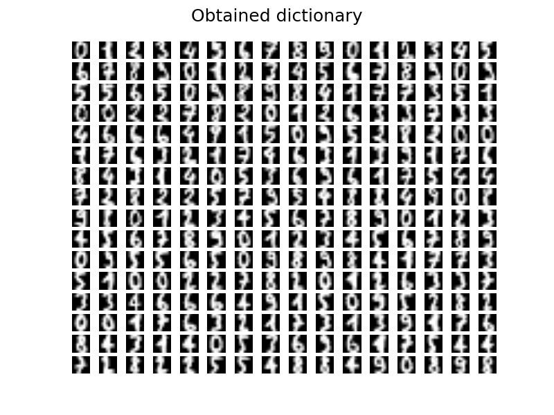

# KSVD.jl

K-SVD is an algorithm for creating overcomplete dictionaries for sparse representations.  

This package implements:

* K-SVD as described in the original paper: [K-SVD: An Algorithm for Designing Overcomplete Dictionaries for Sparse Representation](http://www.cs.technion.ac.il/~freddy/papers/120.pdf)
* [Matching Pursuit](https://en.wikipedia.org/wiki/Matching_pursuit) for representing signals using a given dictionary.

## Example
[Samples of digits dataset in scikit-learn ](http://scikit-learn.org/stable/auto_examples/datasets/plot_digits_last_image.html) and the obtained dictionary of 256 atoms.

See [README in examples](examples/README.md) for more details.

## Provided functions

Only a few functions are provided: `ksvd` and `matching_pursuit`.
See [the documentation](docs/build/index.md).
