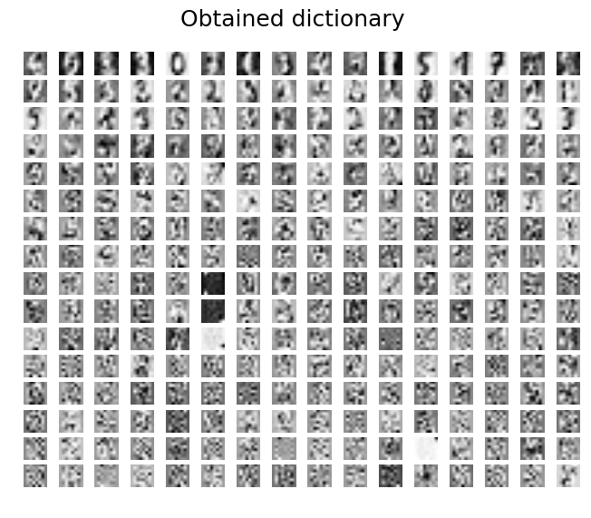

Demonstration using the digits dataset
======================================

You can obtain a dictionary that can represent digits and will be saved as `digits256.dlm` by running `julia digits.jl`.   
Then you can show the obtained dictionary by running `python3 visualizer.py`.  
Please make sure the dependencies are satisfied before running.

# Dependencies
Python 3 packages are required:
* [matplotlib](http://matplotlib.org)
* [scikit-learn](http://scikit-learn.org)
* [numpy](http://numpy.org/)

This example also requires PyPlot.jl but it should already be installed by package dependencies.
